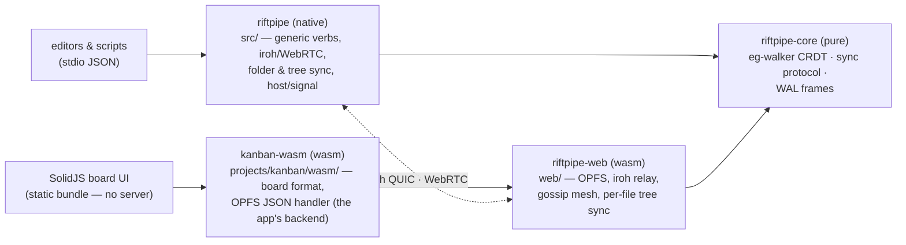
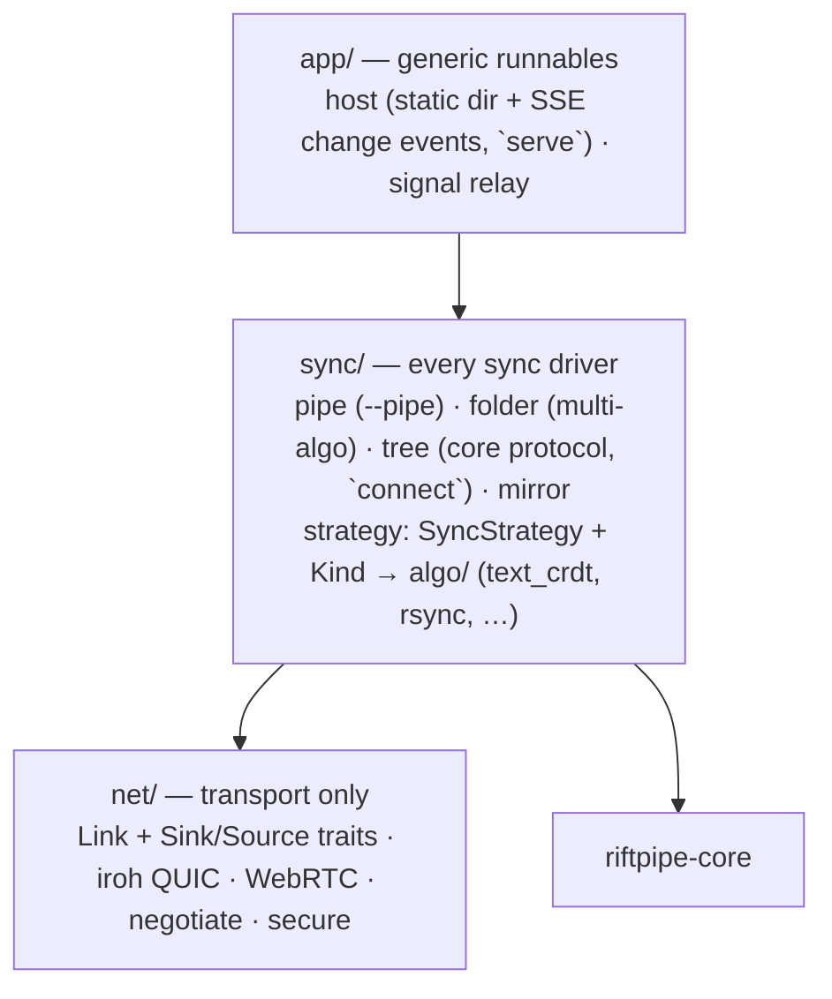
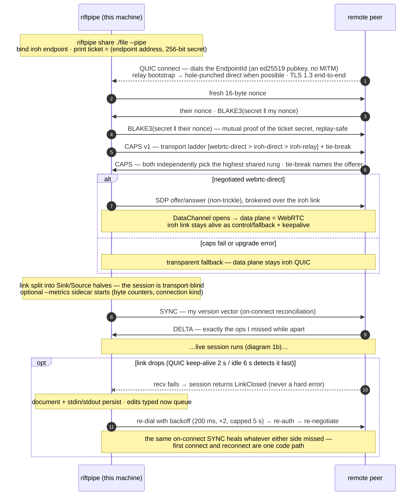
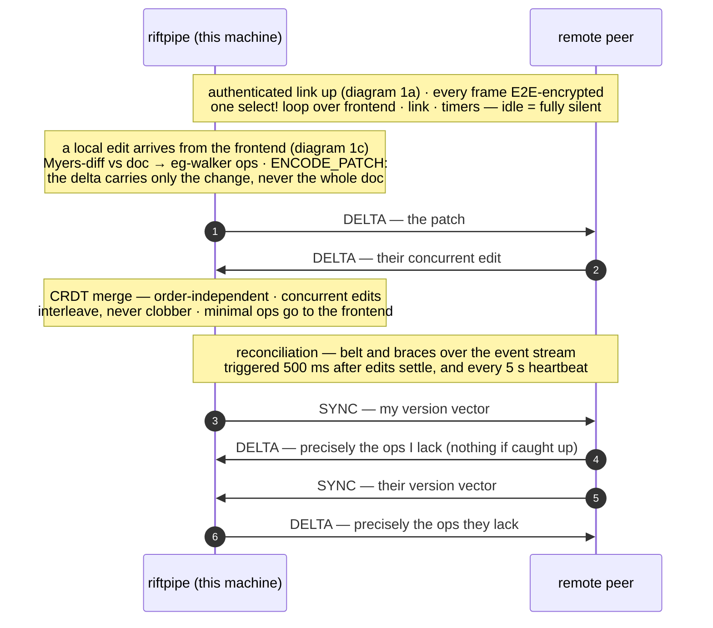
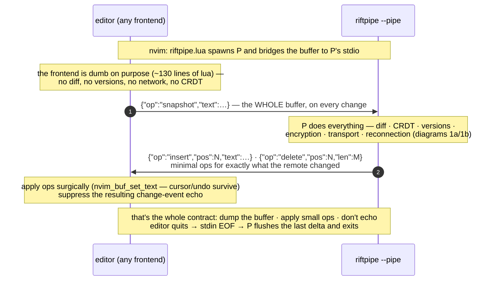
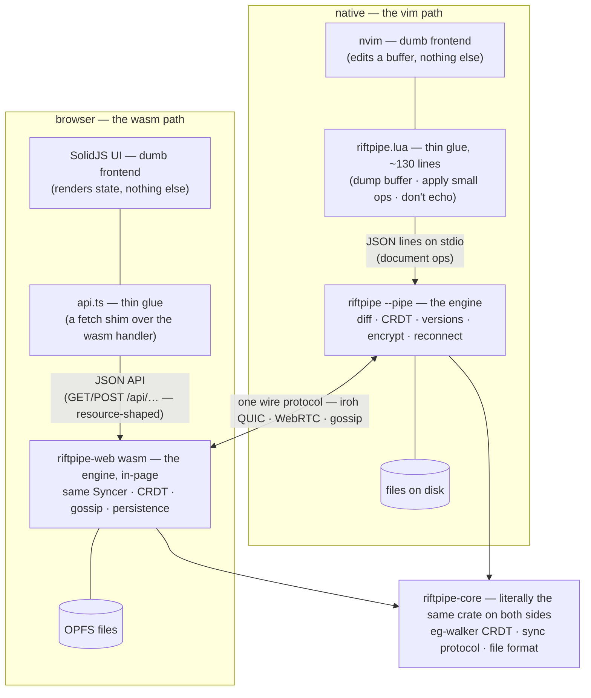

# riftpipe — architecture map

> What actually exists and how it fits together, at the crate/module level.
> The deep design rationale lives in `DESIGN.md`; status in `PROJECT.md`.
> (From the July 2026 code review; update when the layout shifts.)

## Repo layout

```
riftpipe/
  Cargo.toml            root package (native binary) + workspace [core], exclude [web]
  core/                 riftpipe-core — pure, wasm-safe, the single source of truth
  src/                  the native `riftpipe` binary (lib + main) — generic verbs only:
                        share · join · connect · serve · signal
    net/                transport: Link + Sink/Source seams, iroh QUIC, WebRTC,
                        negotiate (caps ladder + NegotiatedSession/Link), secure
    crdt/               re-export shim over riftpipe_core::text
    sync/               every sync driver: --pipe, mirror, folder, tree
      strategy.rs       the SyncStrategy trait + Kind (folder mode's Strategy seam)
      algo/             text_crdt, rsync (real); wal, image (stubs); sqlite (unwired)
    monitor/            metrics + in-memory `process` sidecar
    app/                generic runnables: host (static + SSE), signal relay
  web/                  riftpipe-web — app-generic wasm crate (workspace-excluded,
                        own lockfile): links, gossip mesh, OPFS, tree sync
  projects/kanban/      the showcase app: SolidJS UI + kanban-wasm crate (wasm/ —
                        board format + OPFS handler, links riftpipe-web into the
                        one in-page bundle; no server) + e2e harness + seed board
  nvim/                 Neovim bridge (session-local lua)
  tests/                native integration tests (mock, real iroh, full stack)
  deploy/               fly.io signaling server (legacy/fallback transport)
  docs/                 this file, deploy guide, planned/ (proposals & decisions)
```

## Crate view

Everything that merges, resolves conflicts, or defines a wire format lives once,
in `riftpipe-core` (no I/O, no clock, no transport — compiles native and wasm).
The two platform crates only add transport + storage; the UIs only render.



## Native layers (src/)

Strictly one-directional; each layer only sees the seam below it. The `monitor/`
sidecars (byte counters, in-memory resource report) and the `crdt/` shim are
omitted — they hang off these layers without affecting the shape.



Why the seams hold:

- **`net` exposes two traits and nothing leaks up.** `Link` (whole channel) and
  `Sink`/`Source` (split halves) are the only things the layers above name;
  `net::negotiate::negotiate_session_halves` performs the caps exchange +
  optional WebRTC upgrade and hands back boxed halves, so `sync` never sees a
  concrete transport type.
- **`sync` is the single home for drivers.** `pipe`/`folder` speak the native
  wire formats; `tree` speaks `riftpipe_core::sync` (the browser protocol) so
  native and browser peers interoperate on any file tree. Two wire protocols
  still exist (folder framing vs `SyncMsg`) — that's the remaining
  consolidation candidate, now side-by-side in one module.
- **`app` is generic.** `host` serves a static dir + SSE change events (the
  `serve` verb, also consumable as a library); `signal` relays SDP blobs.
  `connect` dials a link and hands the halves to `sync::tree::run`. No app
  nouns anywhere in the binary.

## The two flagship data paths

**1. Editor collaboration (`--pipe`)** — one peer's view, in three focused
diagrams: how a link comes up (and comes back), what flows over it, and the
tiny contract an editor signs. Drawn from the `share` side; `join` is the
mirror image (decodes the ticket and dials instead of accepting).

### 1a. Connection & reconnection (riftpipe ↔ riftpipe)



### 1b. Sending data (riftpipe ↔ riftpipe)



### 1c. The pipe protocol (editor → riftpipe)

The editor side is deliberately trivial — riftpipe does all the thinking. Any
program that can print JSON lines is a peer: the nvim bridge, a script, a bot.



**2. Browser kanban (serverless)** — browser ↔ browser over the gossip mesh:
the UI calls `kanbanHandle` (from the app's `kanban-wasm` crate) which
reads/writes OPFS via `riftpipe_web::opfs`; every mutation is pushed through
`core::sync::Syncer`
(`card.md` → text-CRDT event, `meta.toml` → LWW) and broadcast on the
iroh-gossip topic; receiving peers merge and land files back into OPFS. New
neighbors are caught up with `full_state()` on `NeighborUp`. A native peer joins
the same board with the generic `riftpipe connect <id> <dir>`, whose
`sync::tree` driver speaks the identical protocol against a real directory —
the binary never knows it's a kanban board.

## One bridge pattern, two dialects (vim vs wasm)

The native editor path and the browser path are the **same four layers**: a
dumb frontend, a thin glue file, the riftpipe engine owning everything hard,
and files as truth. The only real difference is the wire dialect the glue
speaks — JSON lines on stdio for the terminal world, a fetch-shaped JSON API
for the web — because each is what that world's developers already know. The
frontend never sees a CRDT, a version vector, or a socket in either column.



Layer-by-layer, the correspondence is exact:

| concept              | vim path                          | wasm path                          |
|----------------------|-----------------------------------|------------------------------------|
| dumb frontend        | nvim buffer                       | SolidJS store/UI                   |
| thin glue            | `nvim/riftpipe.lua`               | `projects/kanban/src/api.ts`       |
| glue's dialect       | JSON lines on stdio (document ops)| fetch-style JSON API (resources)   |
| the engine           | `riftpipe --pipe` process         | `riftpipe-web` wasm in the page    |
| where files live     | the real filesystem               | OPFS (the browser's private fs)    |
| merge/versions/wire  | `riftpipe-core`                   | `riftpipe-core` (same crate)       |

The dialects sit at different altitudes on purpose: an editor's natural unit
is *document edits*, so the pipe carries ops against one text; a web UI's
natural unit is *resources*, so the API carries cards and comments and the
engine decomposes them into per-file CRDT/LWW sync underneath. Same
architecture, each world addressed in its own idiom.

## Known seams & wrinkles

Fixed in the July 2026 restructure + review series:

- ~~Two unrelated types named `Syncer`~~ — folder mode's trait is now
  `SyncStrategy` (`sync/strategy.rs`); `Syncer` unambiguously means the
  `riftpipe_core::sync` protocol.
- ~~`sync` knew concrete transports~~ — the `Sink`/`Source` halves traits and
  `negotiate_session_halves` moved into `net`; drivers are transport-blind. The
  binary's duplicate negotiation orchestration is gone (`NegotiatedSession` /
  `negotiate_link`, one policy).
- ~~`net` depended on the CRDT~~ — `sync_full` moved from `net/link.rs` to `sync/`.
- ~~Kanban code in the binary~~ — the sync driver is the app-neutral
  `sync::tree` behind `riftpipe connect`; static hosting is generic
  `app::host`; verbs are all generic. The kanban servers themselves (Deno
  reference, then a brief `kanban-server` crate) were subsequently **removed
  entirely** — the wasm payload is the backend.
- ~~Board-sync correctness debt~~ — dotfile leak (`.site`) fixed both
  directions; guard-across-await + triple Arc/Mutex replaced by one select!
  loop with caller-owned `TreePeer`; unbounded echo map → blake3 `seen`;
  watcher failure degrades to poll; first mock-halves tests.

Since fixed in later passes: `connect` speaks all three transports (native
iroh ticket + `--accept`, a **browser share link** via the iroh-gossip mesh —
`core::sync::MeshMsg`, one wire type for `sync::mesh` and `web`'s
`GossipTreeSync`, proven by the `board-cli-mesh` e2e — and the signaling
room fallback); the sqlite orphan became `Kind::LwwRecord` (sqlite.rs
deleted); `web/Cargo.lock` is tracked.

Still open (tracked in `docs/planned/roadmap.md` §Architecture / hygiene):

- **Two wire protocols** (folder framing vs `core::sync` `SyncMsg`).
- **Two deploy stories** — Pages ships the iroh app; `deploy/` + workflow vars
  still treat the signaling server as first-class. (The kanban servers
  themselves are gone — the wasm payload is the backend.)
